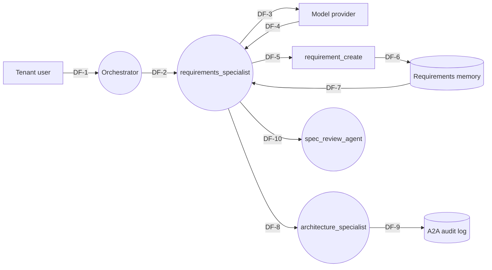

# Example — Product-Dev Orchestrator Threat Model

> **Worked example.** This file is what the artifact looks like for a multi-agent product-development system. The system follows the agent-builder pattern in `agent-builder/plugin/references/methodology/13-agentic-product-dev-synthesis.md`: a triage agent + 7 specialists + 2 reviewers + a coding agent, with workflow-governed handoffs and human checkpoints. Use this example to calibrate threat models that include A2A handoffs and persistent memory.
>
> **Scenario.** "ProductPilot" is a product-development orchestrator that converts a sparse human brief into a buildable spec for a downstream coding agent. New deploy adds a `requirements_specialist` agent that writes structured requirements rows to a persistent memory store and hands them off to the `architecture_specialist` over A2A. Autonomy is A2 (bounded execution in a sandbox); the coding agent that consumes the spec runs at A3.

---

```yaml
---
threat_model:
  name: "ProductPilot: requirements_specialist + memory + A2A handoff"
  version: "0.1.0"
  status: "review"
  author: "Tyrone Ross"
  reviewers: ["Tyrone Ross", "<security-reviewer agent>"]
  date: "2026-05-02"
  scope_summary: |
    Threat model for the new `requirements_specialist` agent, the persistent
    requirements memory store it writes to, and the A2A handoff from
    `requirements_specialist` to `architecture_specialist`. Risk-surface
    signals triggered: new agent, new persistent memory, new A2A surface.
  source_plan: "plan/2026-05-02-add-requirements-specialist.md"
  related_artifacts:
    - "/Users/tyroneross/dev/git-folder/agent-builder/plugin/references/templates/agentic-handoff/system-boundary.md"
    - "/Users/tyroneross/dev/git-folder/agent-builder/plugin/references/templates/agentic-handoff/agent-manifest.md"
    - "/Users/tyroneross/dev/git-folder/agent-builder/plugin/references/templates/agentic-handoff/role-card.md"
    - "/Users/tyroneross/dev/git-folder/agent-builder/plugin/references/templates/agentic-handoff/flow-topology.md"
    - "/Users/tyroneross/dev/git-folder/agent-builder/plugin/references/templates/agentic-handoff/tool-contract.md"
  cross_source_canon: "/Users/tyroneross/dev/git-folder/build-loop/skills/security-methodology/references/cross-source-matrix.md"
---
```

# ProductPilot: requirements_specialist — Threat Model

## 1. System And Scope

**System mission.** ProductPilot is a multi-agent orchestrator that turns a sparse human brief into a buildable specification for a downstream coding agent. It is workflow-governed: deterministic gates between specialists, human checkpoint at pre-build, separate review agents independent of authoring agents.

**In-scope of this artifact.** The new `requirements_specialist` agent (autonomy A2 with `requirement_create` tool at T3, sandboxed write), the persistent requirements memory store (filesystem-backed, append-only, signed entries), and the A2A handoff from `requirements_specialist` to `architecture_specialist`. Risk-surface signals: new agent, new persistent memory, new A2A surface.

**Out-of-scope of this artifact.** The downstream coding agent (its own threat model). The triage agent's existing threat model. The model provider's security at provider level.

**Trust assumption.** The orchestrator's signed identity claim (a JWT with the requesting user's subject and tenant) is enforced by every specialist tool, not just by the orchestrator itself.

## 2. Assets

| ID | Asset | Class | Notes |
|---|---|---|---|
| A-1 | Requirements memory store contents | data + trust | Authoritative source for the spec downstream of this agent. |
| A-2 | Per-user identity claim (JWT) | capability | Carries tenant + subject; load-bearing across A2A handoffs. |
| A-3 | The `requirements_specialist` system prompt | trust | Multi-tenant agent; prompt drift = systemic. |
| A-4 | Audit log of A2A messages | trust | Signed, append-only; non-repudiation. |
| A-5 | Tool credentials for `requirement_create` | capability | Service identity scoped to write-only. |
| A-6 | Token / cost budget per tenant | availability | Multi-tenant — one tenant's runaway is another tenant's outage. |

## 3. Actors

| ID | Actor | Type | Trust assumption | Notes |
|---|---|---|---|---|
| AC-1 | Tenant user | external entity | authenticated, per-tenant scope | drives the brief. |
| AC-2 | Operator | internal | trusted to deploy, read logs, rotate secrets | insider risk applies. |
| AC-3 | `triage_agent` | internal agent | trusted; has system identity | hands off brief to the orchestrator. |
| AC-4 | `requirements_specialist` | internal agent | A2; T3 tool; runs per-tenant | the new agent. |
| AC-5 | `requirement_create` tool | tool | T3 (write reversible — append to store) | the new tool. |
| AC-6 | `architecture_specialist` | internal agent | A2; T2 tools; runs per-tenant | A2A peer downstream. |
| AC-7 | `spec_review_agent` | internal agent | independent of authoring; checks before human checkpoint | review gate. |
| AC-8 | Anthropic / OpenAI / Google model provider | external entity | T1 source | LLM provider. |
| AC-9 | Requirements memory store | internal data store | append-only filesystem; per-tenant directory | new data store. |

## 4. Attacker Personas

| ID | Persona | Goal in this system | Capability | Drives |
|---|---|---|---|---|
| AT-1 | AT-G2 (Authenticated outsider — paying tenant) | Read another tenant's requirements through cross-tenant slip. | Submit briefs with payloads that exercise tenant-scoping bugs. | T-001, T-002 |
| AT-2 | AT-G3 (Insider — operator) | Plant a back door in the system prompt that leaks future requirements. | Deploy a new prompt-template version. | T-003 |
| AT-3 | AT-G5 (Prompt-injection attacker) | Hijack `requirements_specialist` via injected content in the brief or in a tool that fetches third-party content. | User-controlled brief; later a fetch tool. | T-004, T-005 |
| AT-4 | AT-G6 (Compromised A2A peer) | Trick `architecture_specialist` into acting as if a forged requirement came from a tenant. | Replay or forge messages on the A2A channel. | T-006, T-007 |
| AT-5 | System-specific: cost-runaway tenant | DoS one tenant's budget, possibly cascading across tenants. | Submit pathological briefs. | T-008 |

## 5. Data Flow

### 5.1 Elements

| ID | Type | Name | Description |
|---|---|---|---|
| EE-1 | external entity | Tenant user | submits brief. |
| EE-2 | external entity | Model provider | LLM call. |
| P-1 | process | Orchestrator | issues identity claim, routes between specialists. |
| P-2 | process | `requirements_specialist` agent | the new agent. |
| P-3 | process | `requirement_create` tool | append to store. |
| P-4 | process | `architecture_specialist` agent | downstream A2A peer. |
| P-5 | process | `spec_review_agent` | independent review. |
| DS-1 | data store | Requirements memory store | per-tenant append-only directory of signed entries. |
| DS-2 | data store | A2A audit log | signed, append-only, includes input/output hashes. |

### 5.2 Flows

| ID | Source | Sink | Crosses boundary? | Carries |
|---|---|---|---|---|
| DF-1 | EE-1 | P-1 | yes — user→orchestrator | brief, session token |
| DF-2 | P-1 | P-2 | yes — orchestrator→specialist (A2A) | identity claim + brief |
| DF-3 | P-2 | EE-2 | yes — specialist→model provider | system prompt + brief + memory snippets |
| DF-4 | EE-2 | P-2 | yes — model provider→specialist | model output (incl. tool call requests) |
| DF-5 | P-2 | P-3 | no — in-process (same agent context) | requirement payload |
| DF-6 | P-3 | DS-1 | yes — agent→memory store | signed requirement entry |
| DF-7 | DS-1 | P-2 | yes — memory store→specialist (recall) | prior entries |
| DF-8 | P-2 | P-4 | yes — A2A specialist→specialist | identity claim + requirement IDs |
| DF-9 | P-4 | DS-2 | yes — agent→audit | signed message log entry |
| DF-10 | P-2 | P-5 | yes — specialist→reviewer | spec for independent review |

DF-2, DF-6, DF-7, DF-8 are the new flows in this artifact.

### 5.3 Diagram



## 6. STRIDE

```yaml
threats:
  - threat_id: T-001
    stride: [E, I]
    element: "P-3 writing DF-6, P-2 reading DF-7"
    raw_threat: |
      `requirement_create` and the recall path use the tenant ID as written
      in the agent context. If the orchestrator's signed identity claim is
      not enforced *inside* `requirement_create` and the recall query, a
      hijacked agent (T-004) or a prompt-injected goal can read or write
      another tenant's requirements.
    owasp_llm: [LLM07, LLM08]
    owasp_agentic: [ASI03, ASI06]
    mitre_atlas: []
    nist_600_1: [Information Security, Data Privacy]
    severity: CRITICAL
    notes: |
      Cross-tenant access; CRITICAL by default. Mitigation requires the tool
      to validate the JWT, not the agent context.

  - threat_id: T-002
    stride: [I]
    element: "DF-7 (recall)"
    raw_threat: |
      Recall returns prior entries; if the per-tenant directory scoping is
      enforced only by query parameter rather than by signed claim, query
      manipulation reads cross-tenant.
    owasp_llm: [LLM06]
    owasp_agentic: [ASI03, ASI06]
    mitre_atlas: []
    nist_600_1: [Data Privacy]
    severity: CRITICAL

  - threat_id: T-003
    stride: [T, R]
    element: "P-2 system prompt — config plane"
    raw_threat: |
      Operator deploys a new system prompt; if prompt template changes are
      not gated by review and the audit log of prompt-template changes is
      mutable, an insider can plant exfiltration logic that surfaces in
      future requirements written to DS-1.
    owasp_llm: [LLM03]
    owasp_agentic: [ASI06, ASI10]
    mitre_atlas: []
    nist_600_1: [Information Integrity]
    severity: HIGH

  - threat_id: T-004
    stride: [T, E]
    element: "P-2 consuming DF-3 / DF-4 (model output)"
    raw_threat: |
      A brief contains injected instructions that hijack the agent's goal —
      classic ASI01. Severity is amplified by the existence of T3
      `requirement_create` and persistent DS-1: a hijack lands in writable
      state that survives.
    owasp_llm: [LLM01]
    owasp_agentic: [ASI01, ASI06]
    mitre_atlas: [AML.T0051]
    nist_600_1: [Information Integrity]
    severity: HIGH

  - threat_id: T-005
    stride: [T]
    element: "DS-1 entries"
    raw_threat: |
      Memory poisoning. An entry written under one tenant gets surfaced as
      authoritative on a future run — combine with T-001 / T-004 and the
      poison persists across sessions. ASI06 lives here.
    owasp_llm: [LLM01]
    owasp_agentic: [ASI06]
    mitre_atlas: []
    nist_600_1: [Information Integrity]
    severity: HIGH

  - threat_id: T-006
    stride: [S, E]
    element: "DF-8 (A2A handoff)"
    raw_threat: |
      `architecture_specialist` accepts the message because it carries an
      identity claim; if the claim's signature is not verified and the
      tenant scoping is not enforced inside `architecture_specialist`'s
      tools, a forged message escalates from `requirements_specialist`
      compromise to `architecture_specialist` action.
    owasp_llm: []
    owasp_agentic: [ASI03, ASI07, ASI08]
    mitre_atlas: []
    nist_600_1: [Information Security]
    severity: HIGH
    notes: |
      ASI07 has known coverage gap in cross-source matrix — runtime control
      surface for A2A trust is industry-open. Mitigation is custom for now.

  - threat_id: T-007
    stride: [R]
    element: "DS-2 (A2A audit log)"
    raw_threat: |
      If the audit log is not signed and append-only, a compromised
      operator (T-003) can rewrite history to hide T-006 chain.
    owasp_llm: []
    owasp_agentic: [ASI09]
    mitre_atlas: []
    nist_600_1: [Human-AI Configuration]
    severity: MEDIUM

  - threat_id: T-008
    stride: [D]
    element: "DF-3 budget consumption"
    raw_threat: |
      One tenant submits pathological briefs that drive `requirements_
      specialist` into long loops. If budgets are global rather than per-
      tenant, other tenants experience degraded service.
    owasp_llm: [LLM04]
    owasp_agentic: []
    mitre_atlas: []
    nist_600_1: []
    severity: MEDIUM
```

## 7. Mitigations

| ID | Addresses | Description | Control type | Layer | Status | Owner | Evidence | Residual risk | Links |
|---|---|---|---|---|---|---|---|---|---|
| M-001 | T-001, T-002 | `requirement_create` and the recall query verify the JWT signature on every call and use the JWT subject + tenant — not agent context — as the scoping key. Database query layer enforces a `WHERE tenant_id = :jwt_tenant` predicate that cannot be bypassed by query parameters. | preventive | tool + infra | open | Backend lead | TBD — to be built in this PR | Cross-tenant bug class drops to "key compromise + signature forgery", which is mitigated by short-lived (5 min) keys and key rotation. | LLM07, ASI03 |
| M-002 | T-001, T-002, T-006 | Per-tenant directory layout for DS-1; same JWT-driven scoping applied at the filesystem layer. | preventive | infra | open | Backend lead | TBD | Same as M-001 residual. | ASI03, ASI06 |
| M-003 | T-003 | All prompt-template changes go through a four-eyes PR review with security-reviewer agent on the diff; deploy gated by signed-tag CI; prompt-template change log is append-only, signed. | preventive | process + runtime | mitigated | Operator + reviewer | `.github/workflows/prompt-deploy.yml`, `audit/prompt-changes.log` | A coordinated insider attack (operator + reviewer collude) defeats four-eyes; accepted with operator-rotation and quarterly prompt-template audit. See D-002. | LLM03, ASI06, ASI10 |
| M-004 | T-004 | `<untrusted_user_brief>` delimiter in the system prompt; explicit instruction that content inside is data, not instructions; output validator checks for cross-tenant identifiers in proposed requirements. | preventive + detective | prompt + runtime | open | Specialist owner | TBD | Sophisticated payloads survive; held-out adversarial set runs in CI. | LLM01, ASI01 |
| M-005 | T-005 | DS-1 entries are signed by `requirement_create` at write time; on recall, signature must match the writing agent + tenant + timestamp. Entries that fail signature verification are quarantined, not silently dropped, with operator alert. | preventive + detective | infra | open | Backend lead | TBD | Signature scheme correctness; covered by an external review in D-003. | ASI06 |
| M-006 | T-006 | A2A messages are wrapped in a signed envelope: orchestrator-signed identity claim + per-message HMAC over `(sender, recipient, timestamp, body_hash)`; recipient verifies both. Replay window is 5 minutes. | preventive | runtime | open | Orchestrator owner | TBD | Replay within 5 minutes is possible; counter-replay nonce deferred to D-004. | ASI03, ASI07 |
| M-007 | T-007 | DS-2 is append-only on disk (filesystem ACL + WORM where available); each entry signed with a daily-rotated key; archival to immutable storage daily. | preventive | infra | mitigated | Operator | `infra/audit/append-only.tf` | Same-day post-write tampering before archival is possible; window narrows to <24h. | ASI09 |
| M-008 | T-008 | Per-tenant token / cost budget enforced at the orchestrator; `requirements_specialist` rejects calls that would exceed the tenant's bucket; orchestrator-level circuit breaker on per-tenant cost-per-minute. | preventive | runtime | open | Orchestrator owner | TBD | A burst within the budget cap can still degrade latency briefly; accepted. | LLM04 |

## 8. Residual Risk

The artifact has multiple HIGH residuals concentrated on the A2A and tenant-scoping surface. ASI03 + ASI07 + ASI06 stack: a single bug in M-001 / M-002 / M-006 cascades from prompt-injection (T-004) to memory poisoning (T-005) to A2A escalation (T-006) within one user request. Mitigations are well-specified but not yet implemented (`open` rows in §7) — the artifact's overall residual risk is **NOT acceptable for the current planned ship date**. Pre-deploy gate should require all `open` rows to reach `mitigated` with evidence, plus a held-out adversarial test against M-004. Conditions that change this residual: implementation of all `open` mitigations, deployment of M-006's HMAC scheme, and a successful adversarial test sweep.

## 9. Decision Log

```yaml
decisions:
  - decision_id: D-001
    date: 2026-05-02
    type: assumption
    subject: |
      Orchestrator's signed identity claim is the canonical source of tenant
      identity for every downstream specialist and tool.
    context: |
      Tools and agents that derive tenant identity from anywhere else (agent
      context, prompt content, query parameter) are by definition broken.
    links:
      threats: [T-001, T-002, T-006]
      mitigations: [M-001, M-002]
    owner: Tyrone Ross
    status: active

  - decision_id: D-002
    date: 2026-05-02
    type: acceptance
    subject: |
      Coordinated insider attack (operator + reviewer collude) is accepted.
    context: |
      Mitigation requires three-party approval, which exceeds team size.
      Compensating controls: operator rotation, quarterly prompt-template
      audit, key rotation tied to operator offboarding.
    links:
      threats: [T-003]
      mitigations: [M-003]
    owner: Tyrone Ross
    status: active

  - decision_id: D-003
    date: 2026-05-02
    type: deferral
    subject: |
      External review of M-005's signing scheme deferred to pre-deploy.
    context: |
      The scheme is straightforward (Ed25519 over canonical JSON), but a
      second pair of eyes is mandatory before shipping.
    links:
      threats: [T-005]
      mitigations: [M-005]
    owner: Tyrone Ross
    status: active

  - decision_id: D-004
    date: 2026-05-02
    type: deferral
    subject: |
      Counter-replay nonce on A2A envelope deferred to v0.2.
    context: |
      Current 5-minute replay window is acceptable given the threat model
      assumes operator-tier attackers can already plant prompts (T-003).
      Revisit when a non-collusion adversary model becomes relevant.
    links:
      threats: [T-006]
      mitigations: [M-006]
    owner: Tyrone Ross
    status: active

  - decision_id: D-005
    date: 2026-05-02
    type: gap
    subject: |
      ASI07 (inter-agent comms) has no clean general-purpose runtime control
      in the cross-source matrix.
    context: |
      Surface honestly. M-006 is a project-specific HMAC scheme. Industry
      practice is still working out A2A trust models.
    links:
      threats: [T-006]
      mitigations: [M-006]
    owner: Tyrone Ross
    status: active
```

## 10. What Would Change This Artifact

- A new specialist agent is added to the orchestrator graph.
- A new tool is added to `requirements_specialist` (especially T4 / T5).
- The autonomy level of `requirements_specialist` rises from A2 to A3.
- A second tenant boundary is added (e.g., per-project within tenant).
- A new external API call is introduced from any specialist.
- The A2A protocol changes (new envelope shape, new identity scheme).
- The OWASP Agentic Top 10 publishes a v2 with shifted IDs.
- A new persistent memory store is added on either side of the handoff.
- A regulatory regime (GDPR, HIPAA, SOC 2) starts applying to a tenant.

## 11. Cross-Source Cite Manifest

```yaml
cited:
  owasp_llm:    [LLM01, LLM03, LLM04, LLM06, LLM07, LLM08]
  owasp_agentic: [ASI01, ASI03, ASI06, ASI07, ASI08, ASI09, ASI10]
  mitre_atlas:  [AML.T0051]
  nist_600_1:   ["Information Integrity", "Information Security", "Data Privacy", "Human-AI Configuration"]
  references:
    - "https://genai.owasp.org/resource/llm-ai-security-and-governance-checklist/"
    - "https://genai.owasp.org/resource/owasp-top-10-for-agentic-applications-for-2026/"
    - "https://atlas.mitre.org/"
    - "https://atlas.mitre.org/techniques/AML.T0051"
    - "https://nvlpubs.nist.gov/nistpubs/ai/NIST.AI.600-1.pdf"
    - "/Users/tyroneross/dev/git-folder/build-loop/skills/security-methodology/references/cross-source-matrix.md"
    - "/Users/tyroneross/dev/git-folder/agent-builder/plugin/references/methodology/13-agentic-product-dev-synthesis.md"
```
