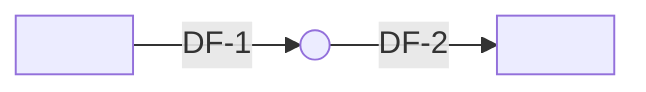

# Threat Model Template

> The artifact this skill produces. Copy this file into the consuming repo at `plan/threat-models/<feature>-threat-model.md` (or wherever the project's plan storage lives), then fill it in by walking the five-step workshop in `references/methodology/`. Filename convention: `<feature>-threat-model.md` or `threat-model-<feature>.md` — both forms match `build-loop:plan-verify` rule 10's regex.
>
> Greppability rules. Predictable headers, predictable threat IDs (`T-NNN`), predictable mitigation IDs (`M-NNN`), predictable status enum (`mitigated | accepted | open | transferred`). Tooling reads this artifact literally — do not rename headers, do not change ID prefixes, do not invent new status values.

```yaml
---
threat_model:
  name: "<feature or system name>"
  version: "0.1.0"
  status: "draft | review | approved"
  author: "<name>"
  reviewers: ["<name>", "<name>"]
  date: "YYYY-MM-DD"
  scope_summary: |
    One sentence naming what is in scope. Example: "Threat model for the
    `run-tests` tool added to the PR-review agent in PR #142."
  source_plan: "<path or URL to the plan / PR / design doc this artifact backs>"
  related_artifacts:
    - "<path to system-boundary.md if present>"
    - "<path to agent-manifest.md if present>"
    - "<path to tool-contract.md if present>"
    - "<path to flow-topology.md if present>"
    - "<path to guardrail.md if present>"
  cross_source_canon: "/Users/<you>/dev/git-folder/build-loop/skills/security-methodology/references/cross-source-matrix.md"
---
```

The YAML front-block above contains the literal string `threat_model:` — that alone satisfies `build-loop:plan-verify` rule 10's regex (`threat[_\s-]?model`). Do not delete the block.

---

# {{ threat_model.name }} — Threat Model

> Walk this template top-to-bottom. Sections are required. If a section truly does not apply, mark it `n/a — <one-line rationale>` rather than deleting it.

## 1. System And Scope

One paragraph (≤ 400 words) covering:

- **System mission.** What this system does, for whom, with which side effects allowed and not allowed.
- **In-scope of this artifact.** What change / feature / component this threat model covers.
- **Out-of-scope of this artifact.** Explicitly named exclusions. Out-of-scope is a security choice; log a decision-log entry for each material exclusion.
- **Trust assumption.** The single most load-bearing trust assumption the rest of the artifact rests on (e.g., "the model provider's tool-calling JSON schema is enforced server-side").

Cross-reference any `system-boundary.md` artifact by absolute path; do not duplicate its YAML.

## 2. Assets

Use a table. Stable IDs (`A-NNN`) so threats can refer back.

| ID | Asset | Class | Notes |
|---|---|---|---|
| A-1 | <asset> | data \| capability \| trust \| availability \| compliance | <one line> |
| A-2 | <asset> | … | … |

Asset class vocabulary matches `references/methodology/03-asset-and-actor-enumeration.md`. Name the **agent's effective prompt** as a first-class asset for any agentic system.

## 3. Actors

Use a table. Stable IDs (`AC-NNN`).

| ID | Actor | Type | Trust assumption | Notes |
|---|---|---|---|---|
| AC-1 | End user | external entity | authenticated, single user per session | <one line> |
| AC-2 | Operator | internal | trusted to deploy and review logs; insider risk applies | <one line> |
| AC-3 | <tool name> | tool | runs with <credential>; <scope> | <one line> |
| AC-4 | Model provider | external entity | T1 source — terms of service trusted, output untrusted | <one line> |

For agentic systems specifically: every tool the agent can call is an actor.

## 4. Attacker Personas

Cite `references/templates/attacker-personas.md` and copy the personas relevant to this system. Add system-specific personas if the generic ones miss something material (e.g., "competitor scraping our agent for prompt theft").

| ID | Persona | Goal | Capability | Notes |
|---|---|---|---|---|
| AT-1 | Outsider | <goal> | <capability> | <one line> |
| AT-2 | Insider | <goal> | <capability> | <one line> |
| AT-3 | Compromised tool / supply chain | <goal> | <capability> | <one line> |
| AT-4 | Prompt-injection attacker (via user input or tool output) | <goal> | <capability> | <one line> |

## 5. Data Flow

Two tables (elements + flows) and an optional mermaid block. See `references/methodology/04-data-flow-diagrams.md` for the schema.

### 5.1 Elements

| ID | Type | Name | Description |
|---|---|---|---|
| EE-1 | external entity | <name> | <one line> |
| P-1 | process | <name> | <one line> |
| DS-1 | data store | <name> | <one line> |

### 5.2 Flows

| ID | Source | Sink | Crosses boundary? | Carries |
|---|---|---|---|---|
| DF-1 | EE-1 | P-1 | yes — <which boundary> | <data> |
| DF-2 | P-1 | EE-2 | yes — <which boundary> | <data> |

### 5.3 Diagram (optional)



## 6. STRIDE

One row per raw threat. Stable threat IDs (`T-NNN`). Element column references the IDs from §5. Cross-mapping fields use the canonical short forms (`LLM01`, `ASI03`, `AML.T0019`, NIST area names).

```yaml
threats:
  - threat_id: T-001
    stride: [T]                                # subset of [S, T, R, I, D, E]
    element: "P-1 consuming DF-3"              # which §5 element / flow
    raw_threat: |
      <one paragraph describing the concrete threat against this element>
    owasp_llm: [LLM01]                         # zero or more
    owasp_agentic: [ASI01]                     # zero or more
    mitre_atlas: []                            # zero or more; optional
    nist_600_1: [Information Integrity]        # zero or more area names
    severity: HIGH                             # CRITICAL | HIGH | MEDIUM | LOW
    notes: |
      <optional: severity calibration, escalation conditions>
```

Repeat for every raw threat from the STRIDE walk in `references/methodology/02-stride-overview.md`.

A row whose stride field is empty (because the threat is content / value, not a security primitive) is allowed; document why in `notes` and use `(no canonical STRIDE category)` rather than forcing a label.

## 7. Mitigations

Single table; rows correspond one-to-many to threats. Schema from `references/methodology/06-mitigation-and-residual-risk.md`.

| ID | Addresses | Description | Control type | Layer | Status | Owner | Evidence | Residual risk | Links |
|---|---|---|---|---|---|---|---|---|---|
| M-001 | T-001, T-003 | <one or two sentences> | preventive | prompt | mitigated | <owner> | <PR / file / config / test> | <one line> | LLM01, ASI01 |
| M-002 | T-002 | <one or two sentences> | detective | runtime | open | <owner> | TBD | <one line> | LLM07, ASI02 |

Status values are exactly: `mitigated | accepted | open | transferred`. No other strings.

## 8. Residual Risk

One paragraph (≤ 200 words). Roll up across mitigations. Name:

- The **highest residual risk** in the artifact (HIGH or above).
- The **conditions that would change it** (a new tool tier, a regulatory change, etc.).
- Whether the artifact's overall residual risk is **acceptable for the system's current autonomy level and tool tier**.

If the residual is not acceptable, the artifact ends with a recommendation that the change not ship as-described, with the specific gap.

## 9. Decision Log

Append-only list. Schema from `references/methodology/07-decision-log-and-versioning.md`.

```yaml
decisions:
  - decision_id: D-001
    date: YYYY-MM-DD
    type: assumption                           # assumption | decision | deferral | acceptance | gap
    subject: |
      <one-line statement>
    context: |
      <a few sentences naming alternatives, choice, and what would change it>
    links:
      threats: [T-NNN]
      mitigations: [M-NNN]
      external: ["<URL>"]
    owner: <name>
    status: active                             # active | superseded | invalidated
```

## 10. What Would Change This Artifact

Bulleted list of events that require regenerating or revising this threat model. See `references/methodology/07-decision-log-and-versioning.md` for the canonical event set; copy the entries that apply, drop the ones that do not, add system-specific events.

- The agent gains a new tool above tier T2.
- The agent's autonomy level changes (A0 → A2 etc.).
- A new external API is added.
- A new class of user data starts being handled.
- A new model provider is added.
- A new persistent memory store is added or an existing one starts accepting agent-written content.
- A new A2A peer is added.
- The orchestrator pattern changes (single-agent ↔ multi-agent).
- An OWASP Top 10 (LLM or Agentic) revision changes ID semantics.
- A MITRE ATLAS update introduces a technique that maps to an existing threat.

## 11. Cross-Source Cite Manifest (optional but recommended)

A short closing block listing every framework ID surfaced in the artifact, deduplicated. Lets reviewers and tooling join the artifact to the canonical sources without re-walking it.

```yaml
cited:
  owasp_llm:    [LLM01, LLM02, LLM06, LLM07, LLM08]
  owasp_agentic: [ASI01, ASI02, ASI03, ASI06]
  mitre_atlas:  [AML.T0019, AML.T0051]
  nist_600_1:   ["Information Integrity", "Information Security", "Data Privacy"]
  references:
    - "https://genai.owasp.org/resource/llm-ai-security-and-governance-checklist/"
    - "https://genai.owasp.org/resource/owasp-top-10-for-agentic-applications-for-2026/"
    - "https://atlas.mitre.org/"
    - "https://nvlpubs.nist.gov/nistpubs/ai/NIST.AI.600-1.pdf"
    - "/Users/<you>/dev/git-folder/build-loop/skills/security-methodology/references/cross-source-matrix.md"
```

---

**Plan-verify rule 10 cite-path note.** A plan that references this artifact by relative path satisfies `build-loop:plan-verify` rule 10 automatically — the path itself contains the substring `threat-model`, which matches the rule's regex. Recommended cite line in the plan markdown:

```markdown
Threat model: see [plan/threat-models/<feature>-threat-model.md](plan/threat-models/<feature>-threat-model.md).
```
